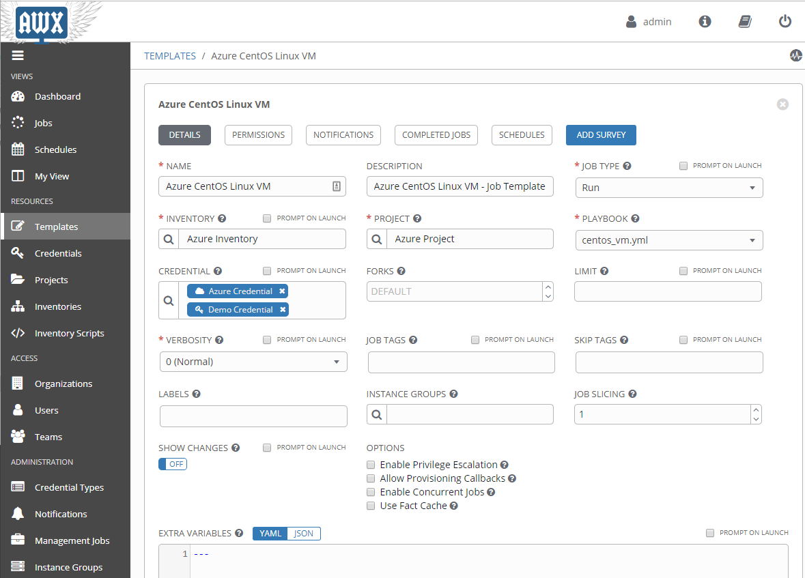
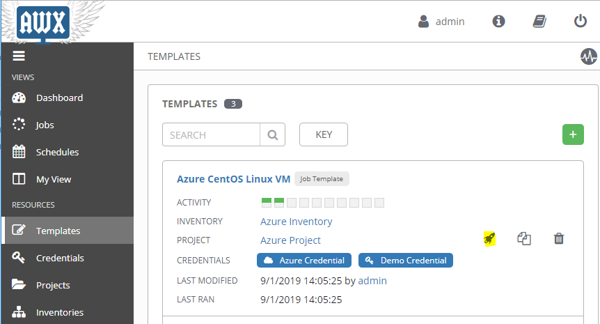
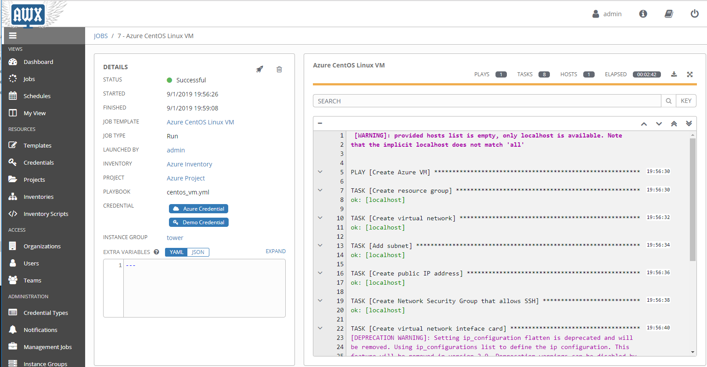
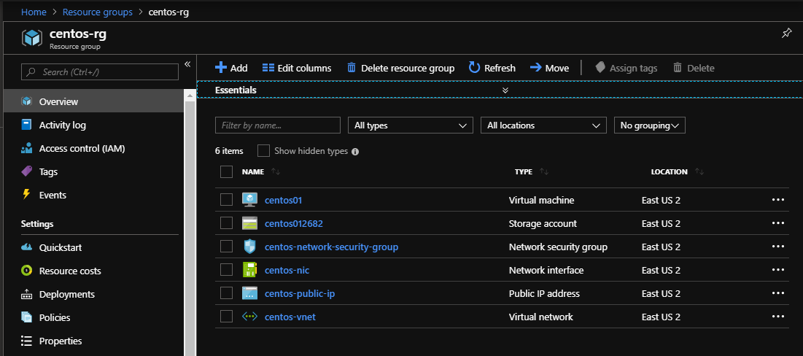

# ansible-azure

## Purpose

Test **Azure** provisioning using **Ansible** and the web-based UI called **AWX** (the Open Source version of **Ansible Tower**):

> AWX provides a web-based user interface, REST API, and task engine built on top of Ansible. It is the upstream project for Tower, a commercial derivative of AWX.

These tools are used to build a local Ansible Control VM using a CentOS 7.6:

- VirtualBox
- Vagrant
- Docker
- Ansible
- Ansible AWX

Once the `Azure CentOS Linux VM` Job Template is run within AWX, these resources will be deployed to Azure:

- A resource group
- A virtual network
- A Public IP address
- A Network security group that allows SSH
- A Network interface card
- A Storage account
- A CentOS VM

## Preparation

Before you can build the local Ansible Control VM, you will need to do the following steps first:

1. Open an elevated PowerShell prompt.
1. Install [Chocolatey](https://chocolatey.org/install):  
    ```powershell
    Set-ExecutionPolicy Bypass -Scope Process -Force; iex ((New-Object System.Net.WebClient).DownloadString('https://chocolatey.org/install.ps1'))
    ```
1. Install [VirtualBox](https://www.virtualbox.org/):  
    ```powershell
    choco install -y virtualbox
    ```
1. Install [Vagrant](https://www.vagrantup.com/):  
    ```powershell
    choco install -y vagrant
    ```
1. [Create an Azure Service Principal](https://adamrushuk.github.io/azure-service-principal-ansible-tower-credential/)
and note down the `SUBSCRIPTION ID`, `CLIENT ID`, `CLIENT SECRET`, and `TENANT ID` values for later use.

## Build

1. Clone this repo to your local computer:
    ```powershell
    git clone git@github.com:adamrushuk/ansible-azure.git
    ```
1. Update your Azure Service Principal credentials in `azure_ansible_credentials.yml`:
    ```bash
    # Overwrite these example values below
    subscription: "aaaa1111-bbbb-cccc-abcd-aaabbbcccddd"
    client: "abcd1234-abcd-efff-1234-abcd12345678"
    secret: "MyStrongPassw0rd!"
    tenant: "12345678-ab12-cd34-ef56-1234abcd5678"
    ```
1. Start the build from the root folder of the cloned repo:
    ```powershell
    vagrant up
    ```

## Verify AWX Build

### Log in to AWX Web Interface

1. Open a browser and navigate to the AWX login page [http://192.168.10.20](http://192.168.10.20).
1. Log in to AWX using the default username `admin` and default password `password`.

### Check AWX Resources

1. Navigate to the Templates page, within the Resources menu.
1. Click on the Template called `Azure CentOS Linux VM`.
1. Ensure there are values entered for `INVENTORY`, `PROJECT`, `PLAYBOOK`, and `CREDENTIAL` as shown below:
    

## Run the Azure Job Template

1. Navigate to the Templates page, within the Resources menu.
1. Click on the rocket icon to start the `Azure CentOS Linux VM` Job Template:
    
1. The `JOBS` screen should then automatically open, where you can monitor the job progress:
    

## Verify Azure Build

1. Navigate to the [Azure Portal](https://portal.azure.com).
1. Ensure you have a Resource Group called `centos-rg` with the following resources:
    

